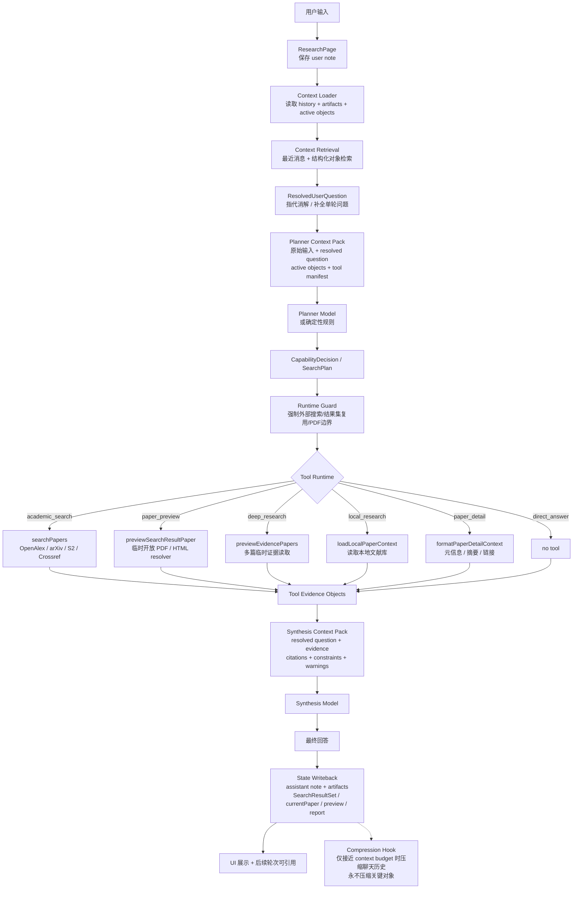

# PR Brief: Agent Context Pack 与 Tool Runtime 架构升级

Status: SUPERSEDED
Audience: implementer
Action: archive
Supersedes: none
Next: Implementation had review findings. Continue with `active/2026-05-03.08.active.brief.reference-binding-crud-fix.md`.

日期：2026-05-03
作者：Codex review/coordination 窗口。本窗口只负责提出 PR brief、目标架构和验收标准，不直接改产品代码。

## 1. 背景

当前 Lumen 已经有初步 Agent Harness：

- `ResearchPage` 负责收集用户输入、历史消息、当前论文、最近搜索结果集，并调用 `runResearchAgent()`。
- `runResearchAgent` 实际导出 `runResearchHarness`。
- `runResearchHarness` 会先做部分结果集引用解析，然后调用 planner，再由 runtime 根据 `intent` 调用搜索、PDF preview、本地论文读取等工具。
- 主模型并不是直接调用工具；planner 只输出 JSON plan，runtime 才真正执行工具。

这套链路已经比普通聊天强很多，但用户测试中出现了明确问题：

- “它们 / 前五篇 / 刚才那 10 篇”容易丢失或指错对象。
- 中间聊了别的话题后，再回到之前结果集，系统可能重搜或换成另一批论文。
- Planner prompt 里有 `availableTools`，但这只是文字说明，不是稳定工具契约。
- 最近消息被固定压缩为少量文本，关键对象也可能被间接丢掉。
- 主模型看到的是 history + 临时 prompt，不是一个稳定、可审计、可复用的“本轮任务上下文包”。

本 brief 的目标是补上 **Resolved User Question + Context Pack + Tool Manifest + Runtime Guard + State Writeback** 这几层。

## 2. 核心设计原则

### 2.1 聊天历史可以压缩，任务关键对象不能压缩

聊天历史是自然语言，可以在上下文窗口接近上限时压缩。

但以下对象必须结构化保存、按 ID 检索、不能被自然语言摘要替代：

- `SearchResultSet`：例如 R1、R2，以及每篇论文的稳定编号、URL、DOI、PDF URL、摘要、来源。
- `currentPaper`：当前正在讨论的论文。
- `PaperEvidenceNote`：临时读取 PDF 后得到的证据等级、文本片段、缓存命中状态。
- `DeepResearchReportArtifact`：多篇论文报告对应的原始 paper refs。
- 用户明确选中的对象：例如“前 5 篇”“R1-1 到 R1-5”。

### 2.2 指代消解不是压缩

“那它们主要讲了什么？”不应该原样丢给 planner。

它应该先被改写为一个语义完整的单轮问题，例如：

```text
请基于结果集 R1 中的 R1-1 到 R1-5 这五篇论文，说明它们主要讲了什么。
```

这一步叫 `ResolvedUserQuestion`。它不是把全部历史压成摘要，而是把当前问题里的指代补全。

### 2.3 Tool 要成为 runtime 可执行契约，而不是 prompt 里的文字

现在 `availableTools` 只出现在 planner prompt 中，模型知道“有工具”，但工具输入输出并没有成为统一契约。

要把工具整理成一份 typed manifest：

- 工具名
- 输入 schema
- 输出 schema
- 何时允许调用
- 是否需要网络
- 是否会写入永久文献库
- 是否只允许临时缓存
- 错误和降级语义

Planner 仍然可以输出 JSON plan，但 runtime 必须根据 Tool Manifest 做强制校验。

### 2.4 主模型应该吃 Context Pack，不应该吃混杂 history

DeepSeek 讨论里的关键点是：决策层最终给主模型的不是原始网页，也不是松散历史，而是一个结构化的最终提示。

Lumen 也应该构造类似的 `ContextPack`：

- 用户原始输入
- 指代消解后的完整问题
- 本轮决策
- 已解析对象
- 工具执行结果
- 证据等级
- 时效性与格式要求
- 明确边界

主模型基于 Context Pack 回答，runtime 再把输出和 artifacts 写回状态。

## 3. 完成后的目标架构



## 4. 建议新增/调整的模块

### 4.1 `src/agent/types.ts`

新增类型：

```ts
export interface ResolvedUserQuestion {
  originalText: string
  standaloneQuestion: string
  referencedResultSetId?: string
  referencedResultSetLabel?: string
  referencedPaperIndices?: number[]
  referencedPapers?: SearchResult[]
  currentPaper?: SearchResult
  ambiguity?: string
  confidence: number
}

export interface ToolManifestEntry {
  name: AgentToolName
  description: string
  inputSchemaSummary: string
  outputSchemaSummary: string
  network: boolean
  writesPermanentLibrary: boolean
  temporaryOnly: boolean
  allowedWhen: string[]
  forbiddenWhen: string[]
}

export interface AgentContextPack {
  originalUserText: string
  resolvedQuestion: ResolvedUserQuestion
  decision: SearchPlan
  activeObjects: {
    currentPaper?: SearchResult
    activeResultSet?: SearchResultSet
    referencedPapers?: SearchResult[]
    recentResultSets?: SearchResultSet[]
  }
  toolResults: unknown[]
  evidence: PaperEvidenceNote[]
  constraints: string[]
  warnings: string[]
}
```

命名可以调整，但语义要保留。

### 4.2 `src/agent/context.ts` 或 `src/agent/context-pack.ts`

新增 Context Pack Builder：

```ts
buildPlannerContextPack(input): PlannerContextPack
buildSynthesisContextPack(input, plan, toolResults): AgentContextPack
formatContextPackForModel(pack): string
```

要求：

- Planner prompt 不再只塞 `compactRecentMessages`。
- 必须显式包含 `resolvedQuestion.standaloneQuestion`。
- 必须显式包含 active result set 和 referenced papers 的稳定编号、标题、URL、DOI、PDF URL。
- 给主模型的 prompt 使用 Markdown 文档格式，不要直接丢大量 JSON。

建议主模型看到的格式：

```text
## 用户原始输入
...

## 指代消解后的本轮问题
...

## 本轮决策
intent: ...
evidenceRequirement: ...

## 已解析对象
R1-1: title / authors / DOI / sourceUrl / pdfUrl

## 工具执行结果
...

## 证据等级与边界
...

## 回答要求
...
```

### 4.3 `src/agent/reference-resolver.ts`

把现在散落在 `tools.ts` / `runtime.ts` 的引用解析提升成独立层。

新增主入口：

```ts
resolveUserQuestion(input: RunResearchHarnessInput): ResolvedUserQuestion
```

职责：

- 识别 `R1`、`R1-1`、`前五篇`、`刚才那批`、`它们`。
- 如果用户说“它 / 这篇”，优先指向 `currentPaper`。
- 如果命中结果集，返回稳定 paper refs，不让 planner 重新猜。
- 如果有歧义，返回 `ambiguity`，runtime 应进入 clarify。
- 不负责搜索，不负责回答。

### 4.4 `src/agent/tool-manifest.ts`

新增工具契约文件。

初版至少包含：

- `direct_answer`
- `academic_search`
- `paper_detail`
- `paper_preview`
- `deep_research`
- `read_local_papers`
- `import_to_library`
- `clarify`
- `feedback`

重点边界：

- `paper_preview` 和 `deep_research` 默认只允许临时读取开放 PDF，不写入永久文献库。
- 只有用户明确说“保存 / 导入 / 加入文献库 / 下载到本地”，才允许 `import_to_library`。
- 外部搜索请求不能落入 `direct_answer` 或 `local_research`。
- 结果集引用优先级高于重新搜索，除非用户明确说“重新搜 / 换一批 / 再搜”。

### 4.5 `src/agent/compression.ts`

新增压缩钩子，但不要急着自动压缩。

原则：

- 当前模型上下文窗口按 1M token 规划。
- 未接近预算时，不做硬压缩。
- 接近预算时，只压缩自然语言聊天历史。
- 不压缩 `SearchResultSet`、`PaperEvidenceNote`、`currentPaper` 等关键对象。
- 用户主动要求“总结/压缩当前对话”时，可以生成 human-readable summary，但仍不能替代结构化对象。

建议接口：

```ts
maybeCompressChatHistory(input, budget): {
  messages: ChatMessage[]
  compressionApplied: boolean
  preservedObjects: string[]
}
```

## 5. Runtime 改造顺序

建议按以下顺序实施，避免一次性大改失控。

1. 新增类型和 Tool Manifest，不改变行为。
2. 新增 `resolveUserQuestion()`，先复用现有 `resolveResultSetReference()` / `resolvePaperReference()`。
3. 在 `runResearchHarness()` 最前面调用 `resolveUserQuestion()`，并写入 planner input。
4. 修改 `buildPlannerUserPrompt()`，让 planner 基于 `resolvedQuestion` 决策。
5. 修改 `buildSynthesisUserPrompt()` / `buildEvidenceSynthesisUserPrompt()`，统一从 Context Pack 生成主模型 prompt。
6. 增加 Runtime Guard：明确外部搜索请求不能进入 `direct_answer` / `local_research`。
7. 增加 Compression Hook，但默认不压缩，先只记录 token estimate / budget 状态。
8. 给 trace 增加 `resolve_user_question`、`build_context_pack`、`tool_runtime_guard` 步骤，方便 review。

## 6. 输入到输出的目标链路

完成后，一轮请求应该这样走：

```text
用户输入
  -> 保存 user note
  -> 加载 history + artifacts + active objects
  -> resolveUserQuestion 指代消解
  -> buildPlannerContextPack
  -> planner 输出 CapabilityDecision / SearchPlan
  -> runtime guard 校验计划
  -> tool runtime 执行搜索 / PDF preview / 本地读取
  -> buildSynthesisContextPack
  -> synthesis model 基于证据回答
  -> 保存 assistant note
  -> 写回 search_results / current_paper / evidence / report artifacts
  -> UI 输出
```

## 7. 关键验收用例

必须通过：

1. 新对话输入“搜索今天 AI 领域的论文”。
   - 应识别为外部学术搜索。
   - 应进入 `recent_ai_feed` 或等价 arXiv category feed。
   - 不能回答“我无法实时搜索”。
   - “今天”必须被识别成当前日期的 timeRange。

2. 搜索完成后，用户问“那前 5 篇做一个研究报告”。
   - 必须复用刚才的结果集，例如 R1-1 到 R1-5。
   - 不允许重新搜索生成另一批论文。

3. 中间插入普通讨论，例如“机器学习有哪些分类？”。
   - 可以直接回答普通问题。
   - 不能覆盖 active result set。

4. 再追问“回到刚才那 10 篇，前五篇做报告”。
   - 必须仍然指向原 R1。
   - 如果存在多个候选结果集，应 clarify，而不是猜。

5. 用户问“把它们的链接拿出来”。
   - 必须从保存的 `SearchResultSet` 输出 source URL / DOI / PDF URL。
   - 不能说“之前没有保存链接”。

6. 用户问“这篇论文结论是什么？”。
   - 如果 `currentPaper` 唯一，走 paper preview。
   - 如果没有唯一 currentPaper，clarify。
   - 不应只基于标题猜。

7. 用户说“把这篇保存到文献库”。
   - 只有这时才允许进入 import flow。
   - 普通 preview/deep research 仍只用临时缓存。

## 8. 不要做的事

- 不要现在就训练或微调小模型。
- 不要把所有问题都交给硬编码 regex。
- 不要为了省 token 固定每 N 轮压缩历史。
- 不要把 `SearchResultSet` 转成自然语言摘要后丢弃原始 URL/DOI/PDF URL。
- 不要让主模型自己声称“我不能搜索”；能不能搜索由 runtime/tool state 决定。
- 不要绕过 paywall，不要集成 Sci-Hub。只找公开开放 PDF、作者主页、arXiv、OSF、SSRN 等合法来源。

## 9. 关于小模型 / 微调的判断

短期不建议训练小模型。

原因：

- 现在最大的问题不是模型能力，而是架构缺少明确的 `ResolvedUserQuestion`、`ContextPack` 和 Tool Runtime Guard。
- 还没有足够干净的日志数据来训练意图分类器。
- 先用现有 planner 模型 + deterministic guard + trace 采集数据，更稳。

中期可以考虑：

1. 记录每轮 `originalText`、`resolvedQuestion`、`decision`、`toolCalls`、`userCorrection`。
2. 把失败样本整理成人工标注数据。
3. 先做 eval set，不急着微调。
4. 如果 planner 成本/延迟明显成为瓶颈，再蒸馏或微调小模型做 `resolve + route`。

## 10. Completion Note

实现完成后，请写：

```text
doc/communication/review/2026-05-03.06.done.notes.agent-context-pack-tool-runtime.md
```

完成记录至少包含：

- 新增了哪些类型和模块。
- `resolveUserQuestion()` 如何处理结果集、当前论文和歧义。
- Context Pack 最终格式示例。
- Tool Manifest 里有哪些工具及边界。
- Runtime Guard 如何防止外部搜索落入 direct answer。
- Compression Hook 当前是否只记录、不压缩。
- 上面 7 条验收用例的测试结果。
