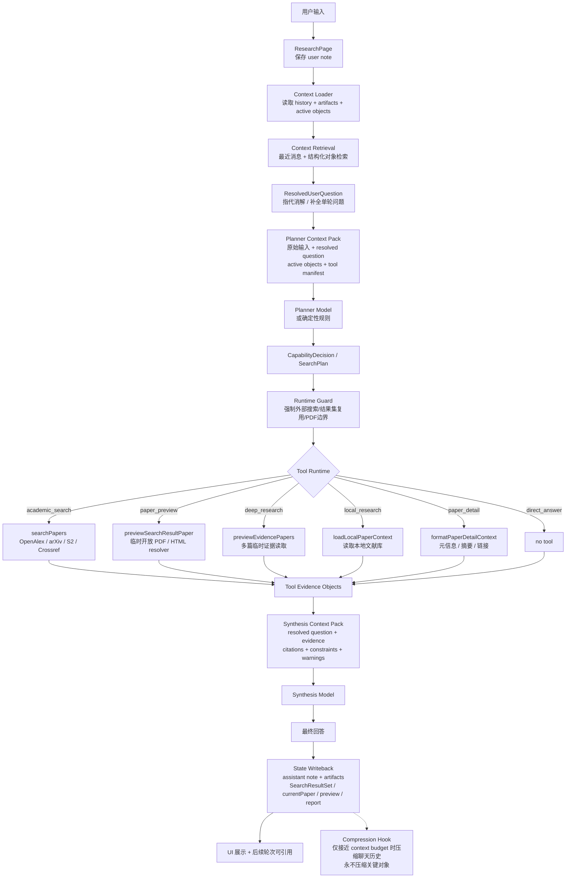

# Research Agent Pipeline Architecture

Status: Incremental implementation in progress
Owner: Lumen research workflow
Last Updated: 2026-05-04

## Goal

Lumen Research should behave like a research-agent pipeline, not a collection of special-case branches in a page or a single runtime function. Every user request should move through the same observable stages:

1. Save the user note.
2. Load conversation and structured context.
3. Retrieve relevant recent objects.
4. Resolve references into a standalone question.
5. Build a planner context pack.
6. Produce a capability decision or search plan.
7. Apply runtime guards.
8. Execute tools through one tool runtime.
9. Convert outputs into tool evidence objects.
10. Build a synthesis context pack.
11. Produce the final answer.
12. Write assistant note and structured artifacts.
13. Keep critical objects outside chat-history compression.

## Target Flow



## Current Problems

- `ResearchPage` currently performs both UI work and state writeback orchestration.
- `runResearchHarness` currently owns context loading, reference resolution, planning, guard behavior, tool execution, synthesis, and output shaping.
- Several branches historically returned early before a standard tool evidence object existed. Clarify, result-set link formatting, feedback confirmation, import warning, paper preview/detail, local research, academic search, deep research, and research judgment now have standard evidence bundles; the remaining complexity is branch dispatch organization inside `runtime.ts`.
- Planner and synthesis packs now have named call sites, but final prompt assembly can still be moved further from `runtime.ts` into `synthesis.ts`.
- Writeback artifact shaping has moved out of `ResearchPage`; UI still applies the writeback plan.
- Compression currently operates around chat messages; structured objects must remain authoritative and must not depend on compressed prose.

## Design

### ResearchPage

ResearchPage should remain responsible for UI state, project creation, saving the user note, calling the agent, rendering the reply, and applying a returned writeback plan. It should not decide which artifacts are written from individual agent fields.

### Context Loader

Create `src/agent/context-loader.ts` to normalize `RunResearchHarnessInput` into a `LoadedResearchContext`. It should expose:

- user text
- history and recent messages
- active project metadata
- active search result set
- recent search result sets
- current paper
- local paper availability
- optional local paper loader

This is the explicit code boundary for “history + artifacts + active objects”.

### Context Retrieval

Create `src/agent/context-retrieval.ts` for lightweight structured retrieval. Initial behavior can preserve current behavior by selecting:

- active result set by id or most recent set
- current paper
- recent result sets
- pre-resolved result set references

`applyRetrievedResearchObjects` materializes the retrieved active result set into the downstream agent context. In particular, `lastSearchResults` should come from the active result set when one exists, rather than from stale page state.

Later this can add vector/object retrieval without changing planner or runtime interfaces.

### Question Resolution

Keep `resolveUserQuestion`, but call it as a named pipeline stage after context retrieval. The output remains `ResolvedUserQuestion`.

Reference-binding rule: bare pronouns such as “它 / 这个 / 那个” do not by themselves bind to persistent `currentPaper`. Binding an old paper object requires `resolvedQuestion.referencedPapers`, `resolvedResultSetReference`, or an explicit paper anchor such as “这篇论文 / 这个论文 / 当前论文 / R1-1 / 第 N 篇”.

### Planner Context Pack

Split the current context pack API into explicit names:

- `buildPlannerContextPack`
- `buildSynthesisContextPack`

Internally both can delegate to existing `buildContextPack` at first. The important change is the call-site contract: planner pack is built before tools; synthesis pack is built after tool evidence objects exist.

Planner prompts must not unconditionally expose historical paper objects. `currentPaper`, `lastSearchResults`, and `recentSearchResultSets` are exposed only when the current turn has an explicit paper/result-set reference or when reference resolution already produced authoritative `referencedPapers`.

### Planner Decision

Keep `SearchPlan` as the initial `CapabilityDecision`. Planning can still use deterministic rules plus model fallback, but all special cases must become decisions instead of final answers where possible.

Allowed direct decisions:

- `clarify`: no external tool; synthesis can be skipped because the decision already contains the clarification text.
- `feedback`: no external tool; synthesis can be skipped.
- `paper_detail`: tool runtime returns metadata evidence.
- `direct_answer`: tool runtime returns no-tool evidence.

Research judgment should not be a final-answer shortcut. It should become a deep research decision with a specific analysis mode.

### Runtime Guard

Runtime guard remains responsible for enforcing:

- explicit external search requests cannot become direct answers.
- referenced result-set requests should reuse structured objects.
- PDF-required requests must use temporary PDF evidence where available.
- permanent library writes only happen on explicit import/save intent.
- metadata/abstract-only evidence cannot be described as full-text reading.

### Tool Runtime

Create `src/agent/tool-runtime.ts` to execute a guarded decision and return `ToolEvidenceBundle`.

Initial tool names:

- `academic_search`
- `paper_detail`
- `paper_preview`
- `deep_research`
- `local_research`
- `direct_answer`
- `clarify`
- `feedback`
- `import_to_library`

The first implementation can delegate to existing functions in `runtime.ts`, then progressively move branches into the tool runtime.

Current slice: `direct_answer`, `clarify`, `feedback`, `import_to_library`, result-set link replies, `academic_search`, `deep_research`, `local_research`, `paper_detail`, `paper_preview`, and `research_judgment` now have explicit `ToolEvidenceBundle` constructors or thin executors. Runtime still owns high-level branch orchestration and trace recording, but search retry orchestration, result-set construction, PDF preview evidence conversion, local-paper context bundling, paper detail/preview bundling, research-judgment evidence bundling, and deep-research report artifact construction now live in `tool-runtime.ts`.

### Tool Evidence Objects

Create a standard evidence envelope:

```ts
export interface ToolEvidenceBundle {
  toolName: AgentToolName
  plan: SearchPlan
  toolResults: ContextToolResult[]
  evidence: PaperEvidenceNote[]
  searchBatches: SearchBatch[]
  searchResults: SearchResult[]
  searchResultSet?: SearchResultSet
  currentPaper?: SearchResult
  currentPaperEvidenceLevel?: CurrentPaperEvidenceLevel
  deepResearchReport?: DeepResearchReportArtifact
  replyOverride?: string
  warnings: string[]
}
```

`replyOverride` is allowed only for non-research outputs such as clarify, feedback, link-only replies, and import warnings. Research outputs should normally synthesize from evidence.

### Synthesis

Create `src/agent/synthesis.ts` to own synthesis functions and consume only:

- resolved question
- guarded decision
- tool evidence bundle
- synthesis context pack

### Writeback

Create `src/agent/writeback.ts` to convert `ResearchAgentResult` into a serializable writeback plan. ResearchPage applies the plan using `addResearchNote` and `addResearchArtifact`.

Writeback items:

- assistant note
- search results artifact
- current paper artifact
- paper preview artifact
- deep research report artifact

### Compression

Compression can remain where it is for now, but the architecture rule is:

- chat text can be compressed near budget pressure.
- structured objects are never compressed into prose-only history.
- context loader must always reload structured objects from artifacts/state.

## Implementation Strategy

This should be an incremental refactor. Each step must preserve user-facing behavior and keep tests green.

1. Add architecture tests around pipeline boundaries.
2. Add type aliases and evidence bundle types.
3. Add context-loader and context-retrieval modules.
4. Add planner/synthesis context pack wrapper names.
5. Add writeback plan builder and move ResearchPage artifact-shaping logic into it.
6. Add tool-runtime skeleton and route one low-risk branch through it.
7. Move paper detail and paper preview branches into tool-runtime.
8. Move academic search and deep research branches into tool-runtime.
9. Convert research judgment from special final-answer branch into a deep-research analysis mode.
10. Audit compression and structured object retention.

## Implemented Slices

- 2026-05-04: Added named pipeline stage list, context loader, context retrieval, planner/synthesis context pack wrappers, synthesis input builder, and writeback planner.
- 2026-05-04: Moved `ResearchPage` artifact shaping to `buildResearchWritebackPlan`.
- 2026-05-04: Added `tool-runtime.ts` evidence bundle constructors for `direct_answer`, `paper_detail`, and `paper_preview`.
- 2026-05-04: Routed `paper_detail` and `paper_preview` runtime output shaping through standard tool evidence bundles while preserving existing resolver and model prompt behavior.
- 2026-05-04: Routed clarify, feedback, answer-response, import warning, and result-set link-only replies through `replyOverride` tool evidence bundles.
- 2026-05-04: Routed `academic_search` and `deep_research` output shaping through standard evidence bundles, including search batches, result sets, PDF preview evidence notes, current-paper evidence level, and deep-research report artifacts.
- 2026-05-04: Routed `local_research` synthesis context through a `read_local_papers` evidence bundle.
- 2026-05-04: Converted `research_judgment` from a final-answer shortcut into a `deep_research` analysis mode: PDF preview evidence is loaded through tool-runtime, the report is generated through the synthesis boundary, and writeback receives paper evidence notes plus a deep-research report artifact.
- 2026-05-04: Moved academic-search retry orchestration, search-result-set construction, deep-research report artifact construction, generic paper preview evidence conversion, and paper/local tool executors into `tool-runtime.ts`.
- 2026-05-04: Tightened reference binding so bare “它/这个” cannot rebind to stale `currentPaper`; `resolvePaperReference` now requires an explicit paper anchor or a planner-supplied reference before using current/sole-result fallback.
- 2026-05-04: Made context retrieval materially affect runtime input through `applyRetrievedResearchObjects`; planner prompt exposure is now gated by resolved references or strong result-set anchors.

## Remaining Architecture Debt

- Runtime still contains high-level branch dispatch and paper-reference resolution. That is intentional for now because reference resolution depends on conversation state and active objects. The remaining cleanup is organizational: split branch handlers into per-intent modules once behavior has more integration coverage.
- Synthesis functions for ordinary search/detail/preview/local answers still live in `runtime.ts`. The synthesis boundary exists and now owns research-judgment report synthesis; moving the remaining prompt assembly into `synthesis.ts` is a follow-up refactor, not a behavior blocker.

## Non-Goals

- Do not replace the current search providers.
- Do not remove existing paper preview resolver behavior.
- Do not make permanent PDF library imports implicit.
- Do not rewrite the UI before pipeline boundaries are testable.
